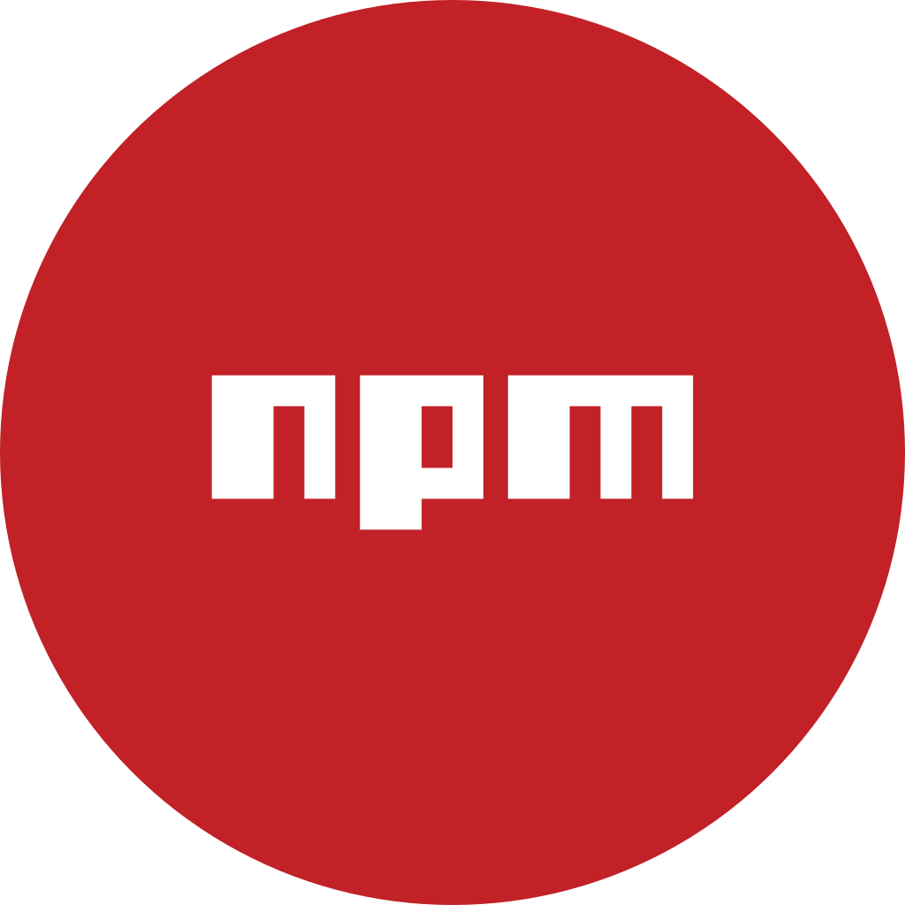

**👋 Привет всем, меня зовут Леонид**

- 👨🏻‍💻 Я начинающий фронтенд-разработчик
- 👨🏻‍🎓 Учусь в Яндекс Практикуме на курсе Frontend разработчик
- 🖥 Хочу создавать современные, удобные сайты и приложения, которые не будут терять своей актуальности и которыми будут пользоваться большое количество людей

### Основной стек и технологии:

&nbsp;
&nbsp;&nbsp;
&nbsp;&nbsp;
&nbsp;&nbsp;
&nbsp;&nbsp;
&nbsp;&nbsp;
&nbsp;&nbsp;
&nbsp;&nbsp;
&nbsp;&nbsp;
&nbsp;&nbsp;
&nbsp;&nbsp;
